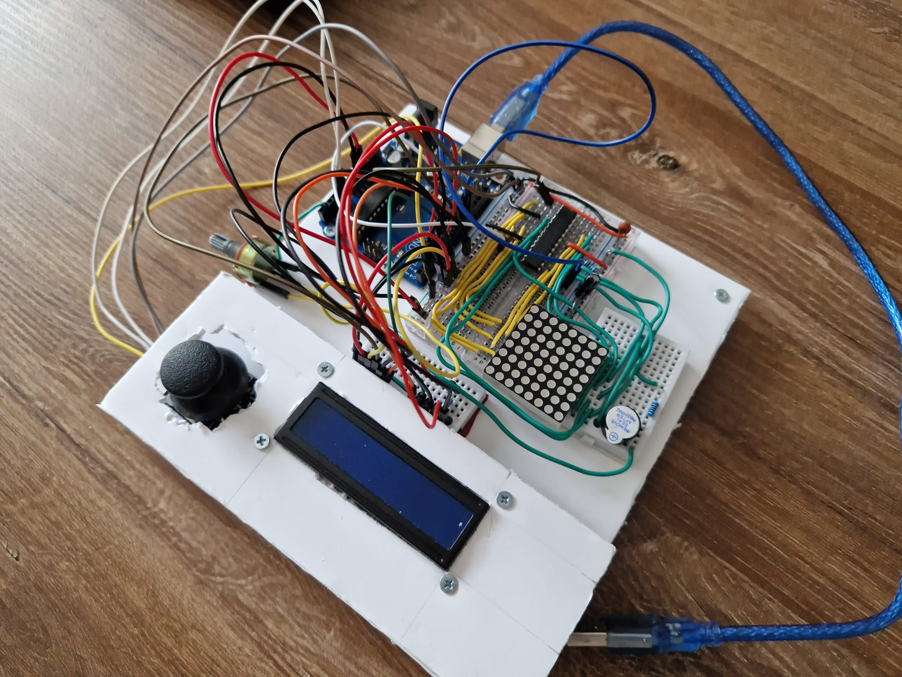
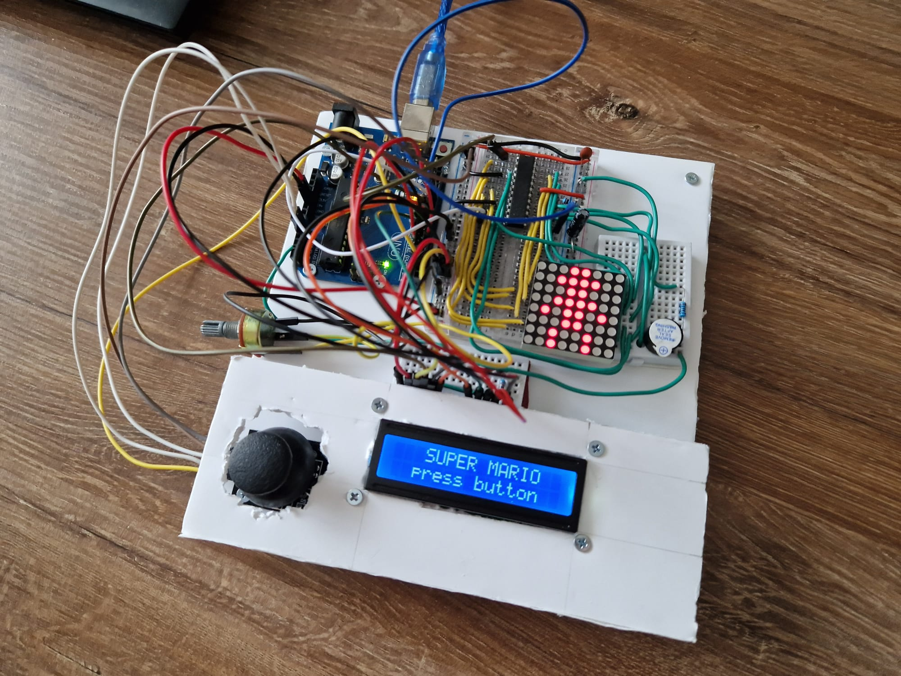
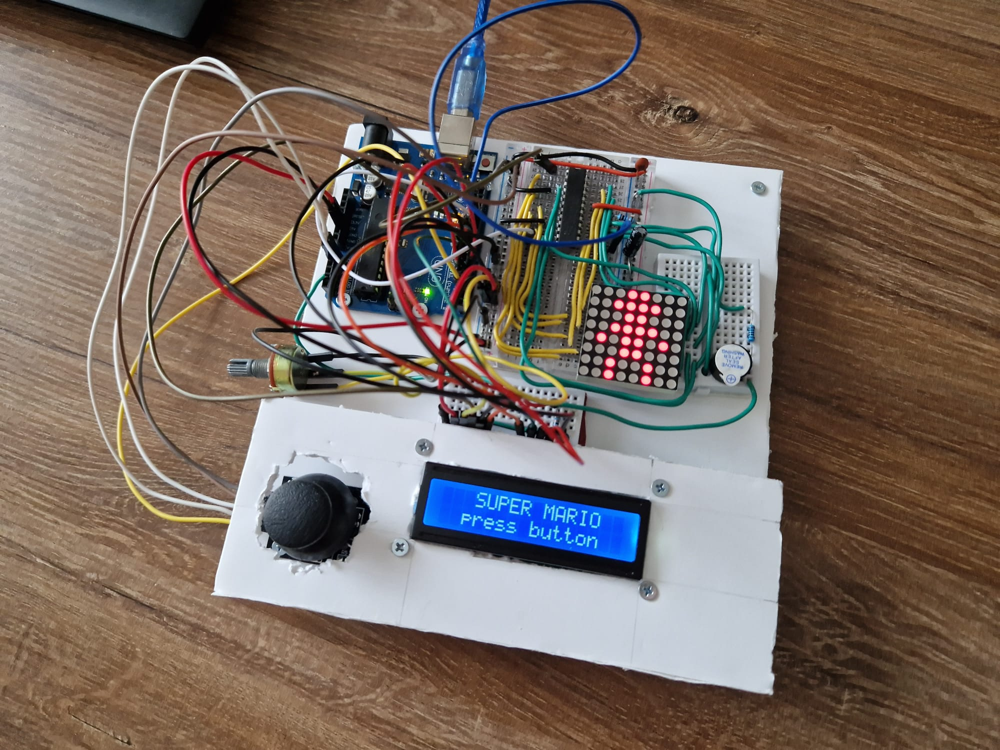

# Super Mario Matrix Game: Project Overview

Welcome to the Super Mario Matrix Game project! This engaging and entertaining venture combines the classic charm of Super Mario with the dynamic capabilities of an 8x8 LED matrix. In this overview, we'll explore the key components of the project, the menu features, and the game requirements to provide you with a comprehensive understanding of what lies ahead.

## Project Highlights

### Menu Features

1. **Intro Message:**
   - A brief and delightful greeting sets the stage as you power up the game, creating an immersive starting experience.

2. **Categories in the Menu:**
   - **Start Game:** Begin your adventure and explore the initial level of the Super Mario-inspired game.
   - **Highscore:**
     - Track and update your high score after each game.
     - Aim for the highest score by starting at advanced levels.
     - Save the top 3+ scores in EEPROM with player names.
   - **Settings:**
     - Enter your name, displayed proudly in the highscore.
     - Adjust LCD and matrix brightness, saving preferences to EEPROM.
     - Toggle game sounds on or off, with additional customizable settings.
   - **About:**
     - Learn more about the creators, including the game name, author, and GitHub link.
   - **How to Play:**
     - A concise and informative guide to get you started on your Mario adventure.

3. **While Playing the Game:**
   - Real-time display of crucial information:
     - Level
     - Score
     - Time

4. **Upon Game Ending:**
   - Screen 1: Celebratory messages 
   - Screen 2: Detailed game info, highscore status, and user prompts.

### Game Requirements

- **Basic Game Features:**
  - Used components: LCD, joystick, buzzer, and an 8x8 LED matrix.
  - Engaging sounds for various in-game events.

- **Level Design:**
  - Each level operates on a 16x16 matrix.
  - Choose between visibility/fog of war or room-based navigation.

- **User Experience:**
  - Intuitive and enjoyable gameplay with seamless progression.
  - Incorporate randomness for added excitement and variability.

## Project Context

I've crafted a Super Mario-inspired game on an 8x8 matrix, leveraging the fog of war concept for a unique gameplay experience. To ensure a clean and organized setup, a physical case has been designed, underscoring your commitment to both functionality and aesthetics.

## Setup pictures

## Youtube video
[Youtube](https://youtu.be/5XqkkA5kgnw)
